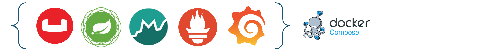

# Demo Actuator Micrometer

This repository demonstrates how to configure custom metrics and custom common tags with the Couchbase SDK using Spring Boot Actuator, Micrometer, and Prometheus. Additionally, it uses the Docker Compose library to easily set up the environment locally.

## Prerequisites

- Java 17
- Maven
- Docker
- Docker Compose

## Dependencies

Project dependencies are managed using Maven. The project uses the following dependencies:

```xml
        <dependency>
            <groupId>org.springframework.boot</groupId>
            <artifactId>spring-boot-starter-data-couchbase</artifactId>
        </dependency>
        <dependency>
            <groupId>com.couchbase.client</groupId>
            <artifactId>java-client</artifactId>
            <version>3.7.1</version>
        </dependency>
        <dependency>
            <groupId>com.couchbase.client</groupId>
            <artifactId>metrics-micrometer</artifactId>
            <version>0.7.4</version>
        </dependency>
        <dependency>
            <groupId>io.micrometer</groupId>
            <artifactId>micrometer-registry-prometheus</artifactId>
            <version>1.13.6</version>
        </dependency>
        <dependency>
            <groupId>org.springframework.boot</groupId>
            <artifactId>spring-boot-starter-actuator</artifactId>
        </dependency>
        <dependency>
            <groupId>org.springframework.boot</groupId>
            <artifactId>spring-boot-docker-compose</artifactId>
            <scope>runtime</scope>
            <optional>true</optional>
        </dependency>
```

| Dependency | Version | Description                                      | Notes     |
| -----------| ------- |--------------------------------------------------|-----------|
| `spring-boot-starter-data-couchbase` | - | Spring Data Couchbase                            | -         |
| `java-client` | 3.7.1 | Overrides the latest Couchbase Java SDK version  | -         |
| `spring-boot-starter-actuator` | - | Spring Boot Actuator                             | -         |
| `metrics-micrometer` | 0.7.4 | Couchbase Micrometer Metrics                     | -         |
| `micrometer-registry-prometheus` | 1.13.6 | Micrometer Prometheus Registry                   | -         |
| `spring-boot-docker-compose` | - | Setting up the environment for local development | Optional  |

## Getting Started

### Clone the Repository

```sh
git clone https://github.com/your-username/demo-actuator-micrometer.git
cd demo-actuator-micrometer
```

### Build the Project

```sh
mvn clean install
```

### Running the Application

#### Setting up the Environment

To start the application along with the required services (Couchbase, Prometheus, etc.) using Docker Compose, run:

```sh
docker-compose up
```

Alternatively, the services will start individually when the application starts thanks to the docker compose library.

```sh
mvn spring-boot:run
```

### Accessing the Application

- **Actuator Endpoints**: `http://localhost:8080/actuator`
- **Prometheus Metrics**: `http://localhost:8080/actuator/prometheus`
- **Couchbase Console**: `http://localhost:8091`
- **Prometheus Console**: `http://localhost:9090`
- **Grafana Console**: `http://localhost:3000`


### Configuration

The application is configured using the `application.yml` file located in `src/main/resources`. Key configurations include:

- **Spring Profile**:
    ```yaml
    spring:
        profiles:
          active: dev
    ```
  
- **Docker Compose**:
    ```yaml
    spring:
      docker:
        compose:
          lifecycle-management: start_only
          start:
            skip: if_running
    ```
  
- **Couchbase Connection**:
  ```yaml
  spring:
    couchbase:
      connection-string: 127.0.0.1
      username: Administrator
      password: password
      bucket-name: demo
  ```
  
- **Actuator Endpoints**:
  ```yaml
  # Configure actuator health probes endpoints: info,health,prometheus,metrics
  management:
    endpoints:
      web:
        exposure:
          include: '*' # Expose all the endpoints
      endpoint:
        prometheus:
          enabled: true # Enabling actuator prometheus endpoint
  ```
  
- **Actuator Metrics & Common tags**:
  ```yaml
  management:
    metrics:
      enable:
        all: true
        jvm: true
        prometheus: true
    prometheus:
      metrics:
        export:
          enabled: true
          step: PT3M
  ```

- **Actuator Common Tags**:
  ```yaml
  management:
    metrics:
      tags:
        application: ${spring.application.name}
        environment: ${spring.profiles.active}
        region: eu-west-1
        instance: ${spring.application.instance_id}
        version: ${spring.application.version}
  ```

### Custom Metrics and Tags

This project demonstrates how to add custom metrics and tags using the Couchbase SDK and Micrometer. The custom metrics are registered in the `CouchbaseConfig` class.

#### Setting up the Couchbase Cluster with Micrometer

```java
@Configuration 
@DependsOn({"forcePrometheusPostProcessor","clusterInfo"})
public class CouchbaseConfig extends AbstractCouchbaseConfiguration {
    private final CouchbaseProperties properties;
    private final ApplicationContext applicationContext;

    public CouchbaseConfig(CouchbaseProperties properties, ApplicationContext applicationContext) {
        this.properties = properties;
        this.applicationContext = applicationContext;
    }
    
  // ... other beans and configurations...

    public Meter getMeter() {
        Meter meterRegistryWrapper = null;
        try {
            MeterRegistry registry = applicationContext.getBean(MeterRegistry.class);
            meterRegistryWrapper = MicrometerMeter.wrap(registry);
        } catch (Exception e) {
            log.error("Failed to create MicrometerMeter, falling back to default LoggingMeter", e);
        }
        return meterRegistryWrapper;
    }


    @Override
    protected void configureEnvironment(ClusterEnvironment.Builder builder) {
        Meter meterRegistryWrapper = getMeter();
        if (nonNull(meterRegistryWrapper)) {
            log.info(" -- Configuring Couchbase Environment with MicrometerMeter -- ");
            builder.meter(meterRegistryWrapper);
        } else {
            log.warn("MeterRegistry not found in the Application Context! Configuring Couchbase Environment with default LoggingMeter");
        }
    }
}
```

Workaround to force the `PrometheusMeterRegistry` to be created before the `CouchbaseConfig` bean:

```java
@Slf4j
@Configuration
public class MicrometerCustomMetricsConfig {

    /**
     * This is a workaround to force the PrometheusMeterRegistry to be initialized
     * @param meterRegistryPostProcessor
     * @param prometheusRegistry
     * @return
     */
    @Bean
    InitializingBean forcePrometheusPostProcessor(BeanPostProcessor meterRegistryPostProcessor, PrometheusMeterRegistry prometheusRegistry) {
        return () -> meterRegistryPostProcessor.postProcessAfterInitialization(prometheusRegistry, "");
    }
    
    // ... other beans and configurations...
}
```

#### Metrics Transformation - Micrometer MeterFilter

  Adding the Cluster uuid as a tag to the Couchbase metrics:
  ```java
  @Slf4j
@Configuration
public class MicrometerCustomMetricsConfig {
    // ... other beans and configurations...

  @Bean
  public MeterFilter meterFilter(ClusterInfo clusterInfo) {
    return new MeterFilter() {
      @Override
      public Meter.Id map(Meter.Id id) {
        return id.getName().startsWith("db.couchbase") ? id.withTag(Tag.of("cluster_id", clusterInfo.uuid())) : id;
      }
    };
  }

  ```

#### Custom Metrics - Micrometer MetricBinder

```java
@Slf4j
@Configuration
public class MicrometerCustomMetricsConfig {
  // ... other beans and configurations...

  @Bean
  public MeterBinder sdkInfoBinder(SdkInfo sdkInfo) {
    return (registry) -> Gauge.builder(METRIC_GAUGE_SDK_INFO, ()-> 1)
            .tags(TAG_SDK_VERSION, sdkInfo.version())
            .register(registry);
  }

  @Bean
  public MeterBinder metricKvConnections(Cluster cluster) {
    return (registry) -> Gauge.builder(METRIC_GAUGE_KV_CONNECTIONS, ()-> cluster.environment().ioConfig().numKvConnections())
            .register(registry);
  }
    
}
```


### References

- [Spring Boot Actuator](https://docs.spring.io/spring-boot/docs/current/reference/html/actuator.html)
- [Micrometer](https://micrometer.io/)
- [Prometheus](https://prometheus.io/)
- [Couchbase SDK](https://docs.couchbase.com/java-sdk/current/hello-world/start-using-sdk.html)


```
Feel free to customize the content as needed.
```